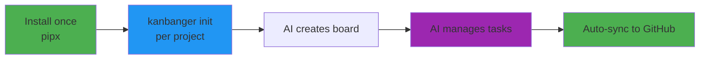
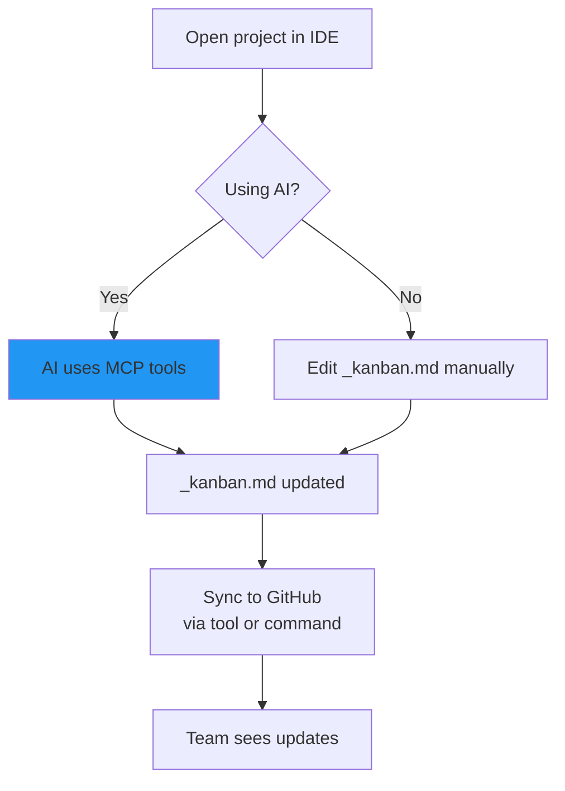

# kanbanger-partymix

> Successor to [`github.com/earlyprototype/kanbanger`](https://github.com/earlyprototype/kanbanger)
> (v2.x archive, read-only). This repo is the v3.0 codebase home; see the
> [kanbanger-platform planning workspace](https://github.com/earlyprototype/kanbanger-platform)
> for strategic context.

**MCP-First Task Management** - Let AI manage your kanban board, sync to GitHub Projects V2

## What is kanbanger-partymix?

kanbanger-partymix is an **MCP (Model Context Protocol) server** that gives AI assistants structured tools to manage your tasks. Your kanban board lives in markdown (`_kanban.md`) and automatically syncs to GitHub Projects.

**Key Benefit**: AI can directly add, move, and sync tasks without you touching files or running commands.

> **For AI agents:** drive the board through the MCP tools (`add_task`, `move_task`,
> `list_tasks`, `sync_to_github`, …). **Never hand-edit `_kanban.md`** — the tools
> handle validation, locking, and atomic writes for you. The install is global
> (one `kanbanger-mcp` for the whole machine — ADR 0002); the **board** is
> project-scoped via each project's `.mcp.json` + `_kanban.md`.
> Full rules: [LLM_GUIDANCE.md](LLM_GUIDANCE.md).

## Quick Start



### 1. Install kanbanger (once per machine)

```bash
pipx install git+https://github.com/earlyprototype/kanbanger-partymix.git
```

Not on PyPI yet — install from git (or a local clone); plain `pip` and
`uv tool install` work the same way. This puts `kanbanger-mcp` (the MCP
server), `kanbanger` (CLI), `kanban-sync`, and `kanban-doctor` on PATH.

### 2. Provision your project (once per project)

From your project's root directory:

```bash
kanbanger init
```

It scaffolds `_kanban.md` (never touches an existing board), writes a
`.mcp.json` that targets the global `kanbanger-mcp` command, and adds the
agent touchpoint to `CLAUDE.md`. Idempotent — safe to re-run. (Equivalent:
ask your AI to call the `setup_project` MCP tool.) See
**[INSTALL.md](INSTALL.md)** for the full flow and how to supply GitHub
credentials.

### 3. Open a fresh Claude Code session

The kanbanger MCP server loads automatically. On first contact, if the project
has no board yet, the assistant tells you Kanbanger isn't set up here and
**asks** whether to set it up — say yes and it creates the canonical 5-column
`_kanban.md` for you.

### 4. Use It!

**With AI (MCP mode):**
```
You: "Add a task to implement user auth to the TODO column"
AI: [Calls add_task tool] ✅ Task added!

You: "Move that task to DOING"
AI: [Calls move_task tool] ✅ Task moved!

You: "Sync to GitHub"
AI: [Calls sync_to_github tool] ✅ Synced!
```

**Manual mode (still works!):**
```bash
# Edit _kanban.md manually, then:
kanban-sync _kanban.md
```

## How It Works

### MCP Integration (Recommended)

Your AI assistant gets these **tools**:
- `add_task(title, column, description)` - Add tasks
- `move_task(title, from, to)` - Move between columns
- `delete_task(title, column)` - Remove tasks
- `list_tasks(column?)` - View tasks
- `sync_to_github(dry_run)` - Push to GitHub
- `get_sync_status()` - Check sync state

And these **resources** (always visible):
- `kanban://current-board` - Live board state
- `kanban://stats` - Task counts
- `kanban://sync-status` - GitHub sync info

Plus **context prompts**:
- `kanban_awareness` - Reminds AI about board
- `task_planning` - Helps break down goals
- `daily_standup` - Morning review
- `github_sync_check` - Sync reminders

### The Workflow



## Kanban Board Format

Create `_kanban.md` in your project root:

```markdown
# Project Kanban

## BACKLOG
*   [ ] Future feature ideas
*   [ ] Nice-to-have improvements

## TODO
*   [ ] Ready to start
*   [ ] Prioritized tasks

## DOING
*   [ ] Currently active work

## REVIEW
*   [ ] Awaiting review before Done

## DONE
*   [x] Completed tasks
*   [x] Finished features
```

**That's it!** No special syntax, just markdown.

## Configuration

### Per-project config (written by provisioning)

`kanbanger init` (or the `setup_project` MCP tool) writes a `.mcp.json` in
your project root that targets the single global install:

```json
{
  "mcpServers": {
    "kanbanger": {
      "command": "kanbanger-mcp",
      "args": [],
      "env": {
        "KANBANGER_WORKSPACE": "${KANBANGER_WORKSPACE:-/abs/path/to/project}",
        "GITHUB_TOKEN": "${GITHUB_TOKEN:-}",
        "GITHUB_REPO": "${GITHUB_REPO:-}",
        "GITHUB_PROJECT_NUMBER": "${GITHUB_PROJECT_NUMBER:-}"
      }
    }
  }
}
```

**Key points:**
- `${VAR:-default}` - Claude Code substitution syntax (not Cursor's `${env:VAR}`).
- **Global install** - one `kanbanger-mcp` on PATH serves every project
  (ADR 0002); no per-project venv to pin.
- **Per-project board** - each project keeps its own `.mcp.json` + `_kanban.md`.

### GitHub credentials

Don't hardcode secrets in `.mcp.json`. Provide real values via the project's
gitignored `.claude/settings.local.json` `env` block, which Claude Code injects
into the MCP server spawn:

```json
{
  "env": {
    "GITHUB_TOKEN": "ghp_...",
    "GITHUB_REPO": "owner/repo",
    "GITHUB_PROJECT_NUMBER": "6"
  }
}
```

**Get a GitHub Token:**
1. GitHub Settings → Developer Settings → Personal Access Tokens
2. Generate new token (classic)
3. Required scopes: `repo`, `project`, `read:org`

## Commands

| Command | Purpose |
|---------|---------|
| `kanbanger init` | Provision a project (board + `.mcp.json` + touchpoint) |
| `kanban-doctor` | Preflight / diagnose a project's install |
| `kanban-sync _kanban.md --dry-run` | Preview changes (safe) |
| `kanban-sync _kanban.md` | Sync to GitHub |
| `python -m kanbanger --help` | MCP server options |

**Or just ask your AI!**
- "Add task X to TODO"
- "Move task Y to DOING"
- "Sync to GitHub"

## Why MCP-First?

### Traditional Approach (Fragile)
```
User: "Add a task"
AI: *Reads _kanban.md*
AI: *Edits file with search/replace*
AI: *Runs terminal command*
AI: *Hopes nothing broke*
```

### MCP Approach (Robust)
```
User: "Add a task"
AI: add_task("Task name", "TODO") ✅
```

**Benefits:**
- ✅ Type-safe, validated operations
- ✅ AI always aware of board state (resources)
- ✅ Context injected automatically (prompts)
- ✅ Works across all AI clients (Cursor, Claude, etc.)
- ✅ No parsing errors or file corruption

## Multiple Projects

One global install serves every project; each project keeps its own board
and config:

```
ProjectA/
├── .mcp.json                     # Targets the global kanbanger-mcp
├── _kanban.md                    # ProjectA's own board
└── .claude/settings.local.json   # GitHub creds (gitignored)

ProjectB/
├── .mcp.json
├── _kanban.md
└── .claude/settings.local.json
```

Run `kanbanger init` once per project — each server spawn is scoped to its
project's workspace, so boards never mix.

## Documentation

- **[INSTALL.md](INSTALL.md)** - Install once + provision per project (the authoritative setup guide)
- **[Setup Flow Diagram](docs/setup-flow.md)** - Visual guide
- **[LLM Guidance](LLM_GUIDANCE.md)** - MCP-first rules for AI agents (use the tools, never hand-edit)
- **[Contributing](CONTRIBUTING.md)** - How to contribute

## Git Hooks (Optional Enforcement)

Want to ensure the board is always synced? Install git hooks:

```bash
cd git-hooks
./install-hooks.sh  # or install-hooks.ps1 on Windows
```

- **Pre-commit**: Checks board is synced before commit
- **Post-commit**: Auto-syncs after commit

## Troubleshooting

### MCP Tools Not Showing

**Fresh machine?** The project's `.mcp.json` targets the global `kanbanger-mcp`
command — if kanbanger isn't installed on this machine, the server can't spawn.
Install once
(`pipx install git+https://github.com/earlyprototype/kanbanger-partymix.git`)
and restart. Then:

1. **Check the config exists:**
```bash
ls .mcp.json
```

2. **Check the global command resolves:**
```bash
kanbanger-mcp --help
```

3. **Restart Claude Code** - required after `.mcp.json` changes.

4. **Run the doctor** - `kanban-doctor` reports common install problems.

### Sync Failures

1. **Verify credentials:**
```bash
# Check .env exists
cat .env

# Test token
curl -H "Authorization: token YOUR_TOKEN" https://api.github.com/user
```

2. **Check project exists:**
   - Go to your repo on GitHub
   - Verify Project is linked
   - Check Status field has: Backlog, Todo, InProgress, Review, Done

### Wrong Workspace

If the MCP server can't find `_kanban.md`:

1. **Use the project-local config** - `.mcp.json` in the project root (not global)
2. **Check the workspace** - did Claude Code open the correct folder?
3. **Restart Claude Code** - reloads configuration

## FAQ

**Q: Can I use CLI without MCP?**  
A: Yes! `kanban-sync _kanban.md` works standalone.

**Q: Does MCP work in other IDEs?**  
A: Yes! Cursor, Claude Desktop, VS Code (with extension), any MCP client.

**Q: What if I already use GitHub Projects?**  
A: Kanbanger syncs one-way: local → GitHub. Your project becomes a view of your markdown.

**Q: Can I use with multiple GitHub Projects?**  
A: Yes, different project per workspace. Each workspace configured independently.

**Q: Is PyPI available?**  
A: Not yet — install from git via pipx for now. A PyPI release is planned.

## Examples

### AI Workflow
```
Morning:
You: "Show me daily standup prompt"
AI: [Shows standup review with current board state]

You: "Add task to implement OAuth to TODO"
AI: ✅ Added

You: "I'm starting work on OAuth"  
AI: ✅ Moved to DOING

Afternoon:
You: "OAuth is done"
AI: ✅ Moved to DONE

Evening:
You: "Sync everything to GitHub"
AI: ✅ Synced - 1 created, 1 updated
```

### Manual Workflow
```bash
# Edit _kanban.md in your editor
vim _kanban.md

# Preview changes
kanban-sync _kanban.md --dry-run

# Sync for real
kanban-sync _kanban.md
```

## Project Status

- ✅ MCP Server
- ✅ GitHub Projects V2 sync
- ✅ Single global install + in-MCP provisioning (`setup_project` / `kanbanger init`)
- ✅ First-run onboarding (AI offers to create the board)
- ✅ Git hooks
- ✅ `kanban-doctor` preflight
- 🔄 Bidirectional sync (planned)
- 🔄 Multiple kanban files (planned)
- 🔄 VS Code extension (planned)

## License

MIT - See [LICENSE](LICENSE)

## Contributing

Contributions welcome! See [CONTRIBUTING.md](CONTRIBUTING.md)

## Credits

Built with the Model Context Protocol (MCP) ecosystem. Inspired by the workspace-aware patterns in [fckgit](https://github.com/earlyprototype/fckgit).

---

**Made with ❤️ for developers who want AI-assisted task management without leaving their editor.**
