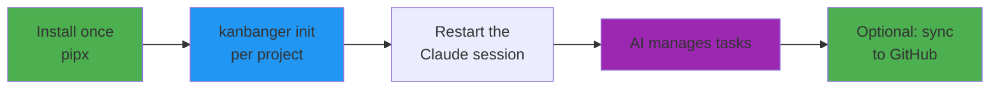

# kanbanger-partymix

**MCP-first task management** — your AI assistant manages a markdown kanban board, optionally synced to GitHub Projects V2.

kanbanger-partymix is an **MCP (Model Context Protocol) server** that gives AI assistants structured tools to manage your tasks. The board lives in plain markdown (`_kanban.md`) in your project root; the AI adds, moves, and syncs tasks through validated tools instead of editing files by hand.

## How it works

- **The board is a markdown file.** `_kanban.md` in your project root, five columns: **BACKLOG → TODO → DOING → REVIEW → DONE.** Readable and diffable like any other file in the repo:

  ```markdown
  # Project Kanban

  ## BACKLOG
  *   [ ] Future feature ideas

  ## TODO
  *   [ ] Ready to start, prioritised

  ## DOING
  *   [ ] Currently active work

  ## REVIEW
  *   [ ] AI-completed work awaiting human approval

  ## DONE
  *   [x] Completed, human-approved work
  ```

  A board with only four columns gets the REVIEW column added automatically at server start.

- **AI drives it through MCP tools.** `add_task`, `move_task`, `list_tasks`, … — every change is validated, locked, and written atomically. Agents never hand-edit the file. Full rules for AI agents: [LLM_GUIDANCE.md](LLM_GUIDANCE.md).

- **REVIEW gates DONE.** AI-completed work goes to REVIEW via `propose_done`; a human approves it to DONE via `approve_done` (or sends it back with `reject_review`). The server enforces this — moving a task into DONE from any column other than REVIEW is refused with a `gate_violation` error.

- **Install once, board per project.** One global `kanbanger-mcp` on PATH serves every project; each project keeps its own `_kanban.md` + `.mcp.json`, so boards never mix.

- **GitHub sync is optional and currently one-way (markdown → GitHub Projects).** Configure it and the board pushes to a GitHub Projects V2 board. The markdown stays the source of truth; edits made on the GitHub side are not pulled back.

## Quick start



### 1. Install kanbanger (once per machine)

```bash
pipx install git+https://github.com/earlyprototype/kanbanger-partymix.git
```

Not on PyPI yet — install from git or a local clone. Plain `pip install` and `uv tool install` work the same way. No git client? Install from the source zip:

```bash
pip install https://github.com/earlyprototype/kanbanger-partymix/archive/refs/heads/main.zip
```

This puts four commands on PATH: `kanbanger-mcp` (the MCP server), `kanbanger` (CLI), `kanban-sync`, and `kanban-doctor`. With pipx, run `pipx ensurepath` if the commands don't resolve. With `pip install --user` on Windows, make sure Python's user `Scripts` directory is on PATH (pip prints the exact path in a warning if it isn't).

### 2. Provision your project (once per project)

From your project's root directory:

```bash
kanbanger init
```

It scaffolds `_kanban.md` (an existing board is never clobbered), writes a `.mcp.json` that targets the global `kanbanger-mcp` command, and adds the agent touchpoint to `CLAUDE.md`. Idempotent — safe to re-run. (Equivalent: ask your AI to call the `setup_project` MCP tool.) See **[INSTALL.md](INSTALL.md)** for the full flow.

### 3. Restart the Claude session

`.mcp.json` is read at session start, so open a fresh session after init. On first contact, if the project has no board yet, the assistant tells you Kanbanger isn't set up here and **asks** whether to set it up — say yes and it provisions the canonical 5-column `_kanban.md` for you.

### 4. Use it

**With AI (MCP mode):**

```
You: "Add a task to implement user auth to TODO"
AI: [add_task] ✅ Task added

You: "I'm starting on auth"
AI: [move_task TODO → DOING] ✅ Moved

You: "Auth is finished"
AI: [propose_done] ✅ Moved to REVIEW — awaiting your approval

You: "Looks good — approve it"
AI: [approve_done] ✅ Done
```

**Manual mode (still works):**

```bash
# Edit _kanban.md in your editor, then:
kanban-sync _kanban.md --dry-run   # preview
kanban-sync _kanban.md             # sync to GitHub
```

## GitHub Projects V2 sync

Optional. Sync is currently **one-way** (markdown → GitHub Projects). Tasks become draft issues on the Project; tasks removed locally are archived (not deleted) on GitHub; sync state lives in a `.kanban.json` sidecar next to the board.

### One-time GitHub setup

**1. Create a GitHub Project (V2).** User-level (`github.com/users/<you>/projects`) or org-level both work.

**2. Link the Project to your repository.** On the repo: Projects tab → "Link a project". This is mandatory — kanbanger discovers projects through the repository's linked-projects list, so an unlinked project is invisible to sync even if you own it.

**3. One-time: set the project's Status options** to exactly `Backlog, Todo, InProgress, Review, Done` (rename GitHub's default 'In Progress'; add 'Backlog' and 'Review'). Automating this is tracked.

**4. Note the project number.** It's the `N` in the project URL (`github.com/users/<you>/projects/N`). Optional — when unset, the first project linked to the repo is used — but set it whenever more than one project is linked.

**5.** Create a ***Classic Personal Access Token***.

> **Click path (it's well hidden):** GitHub → your avatar → **Settings** → **Developer settings** (bottom of left sidebar) → **Personal access tokens** → **Tokens (classic)** → **Generate new token (classic)** → scopes: `repo` + `project`.

- Fine-grained tokens (`github_pat_…`) **do not work** — they cannot access the Projects V2 GraphQL API.
- OAuth tokens from `gh auth token` (`gho_…`) work, but are replaced whenever `gh auth login` runs again; `kanban-doctor` warns about them. Prefer a dedicated classic PAT for anything long-lived.

### Supplying the credentials

Three values: `GITHUB_TOKEN`, `GITHUB_REPO` (`owner/repo`), and (recommended) `GITHUB_PROJECT_NUMBER`. Where they go depends on the path:

**MCP path** (AI calls `sync_to_github`): put them in the project's gitignored `.claude/settings.local.json` `env` block — Claude Code injects it into the MCP server spawn. The project's `.mcp.json` carries only empty `${VAR:-}` placeholders; never paste real values there.

```json
{
  "env": {
    "GITHUB_TOKEN": "ghp_...",
    "GITHUB_REPO": "owner/repo",
    "GITHUB_PROJECT_NUMBER": "6"
  }
}
```

**CLI path** (`kanban-sync`): put them in a `.env` file in the project root. The `.env` deliberately **overrides** the shell environment, so a stale exported `GITHUB_REPO` from another project can't silently route your sync to the wrong board. On Windows, save `.env` as UTF-8 **without** BOM — see [INSTALL.md](INSTALL.md) for the details.

### First sync

1. Restart the Claude session so the MCP server picks up the new env values.
2. Ask your assistant to verify the setup — it can run a dry-run sync (`sync_to_github` with `dry_run`) and report what would change. (`kanban-doctor` remains the manual/CI diagnostic.)
3. Real run: ask for a sync — `sync_to_github()` creates draft issues for new tasks, archives removed ones, and writes the `.kanban.json` state sidecar. (CLI: `kanban-sync _kanban.md`.)

## Commands

| Command | Purpose |
|---------|---------|
| `kanbanger init` | Provision a project (board + `.mcp.json` + touchpoint) |
| `kanban-doctor` | Preflight / diagnose a project's install and sync config |
| `kanban-doctor --local-only` | Assert a board is local-only (missing sync config skips, not fails) |
| `kanban-sync _kanban.md --dry-run` | Preview sync changes (safe) |
| `kanban-sync _kanban.md` | Sync to GitHub |
| `python -m kanbanger --help` | MCP server options |

**Or just ask your AI:** "Add task X to TODO", "Move task Y to DOING", "Sync to GitHub".

## MCP Tool Reference

Your AI assistant gets these **tools**:

| Tool | Purpose |
|------|---------|
| `setup_project()` | Provision this workspace (idempotent) |
| `add_task(title, column, description?)` | Add a task |
| `move_task(title, from_column, to_column)` | Move a task between columns |
| `delete_task(title, column)` | Remove a task |
| `list_tasks(column?, verbose?)` | View tasks |
| `propose_done(title)` | Move AI-completed work to REVIEW |
| `approve_done(title)` | Approve a REVIEW task to DONE (human decision) |
| `reject_review(title, reason)` | Send a REVIEW task back with feedback |
| `sync_to_github(dry_run?)` | Push the board to GitHub |
| `get_sync_status()` | Check sync state |

These **resources** (always visible):

- `kanban://current-board` — live board state
- `kanban://stats` — task counts
- `kanban://sync-status` — GitHub sync info
- `kanban://config` — effective server configuration

And these **prompts**:

- `kanban_awareness` — reminds AI about the board
- `task_planning` — helps break down goals
- `daily_standup` — morning review
- `review_gate_etiquette` — how to use the REVIEW gate
- `github_sync_check` — sync reminders

## Configuration reference

### `.mcp.json` (written by provisioning)

`kanbanger init` (or the `setup_project` MCP tool) writes a `.mcp.json` in your project root that targets the single global install:

```json
{
  "mcpServers": {
    "kanbanger": {
      "command": "kanbanger-mcp",
      "args": [],
      "env": {
        "KANBANGER_WORKSPACE": "${KANBANGER_WORKSPACE:-/abs/path/to/project}",
        "GITHUB_TOKEN": "${GITHUB_TOKEN:-}",
        "GITHUB_REPO": "${GITHUB_REPO:-}",
        "GITHUB_PROJECT_NUMBER": "${GITHUB_PROJECT_NUMBER:-}"
      }
    }
  }
}
```

`${VAR:-default}` is Claude Code's substitution syntax (not Cursor's `${env:VAR}`). The GitHub slots are empty placeholders by design — supply real values per the [credentials section](#supplying-the-credentials) above.

### Environment variables

| Variable | Purpose |
|----------|---------|
| `KANBANGER_WORKSPACE` | Directory containing `_kanban.md` (defaults to the resolved project dir) |
| `GITHUB_TOKEN` | Classic PAT with `repo` + `project` scopes |
| `GITHUB_REPO` | `owner/repo` the Project is linked to |
| `GITHUB_PROJECT_NUMBER` | Project number from the project URL (optional; first linked project used when unset) |
| `KANBANGER_SYNC_TIMEOUT_SEC` | Timeout for the `sync_to_github` tool's sync run (default 60) |

### `.kanban.json` (sync state sidecar)

Created next to the board on first sync. It pairs local task titles with their GitHub item ids so re-syncs update instead of duplicate. It's machine-state, not content — **add it to `.gitignore`**. If it's deleted, the next sync re-creates state (and can duplicate items already on the Project), so leave it alone.

### The board-id marker

Provisioning inserts one comment under the board's title:

```markdown
<!-- kanbanger:board-id: 3f2a… -->
```

It is the board's stable identity — sync and the server use it to make sure they're talking to the right board. Don't delete it. It's the only change ever made to a pre-existing board; every other byte is preserved.

## Multiple projects

One global install serves every project; each project keeps its own board and config:

```
ProjectA/
├── .mcp.json                     # Targets the global kanbanger-mcp
├── _kanban.md                    # ProjectA's own board
└── .claude/settings.local.json   # GitHub creds (gitignored)

ProjectB/
├── .mcp.json
├── _kanban.md
└── .claude/settings.local.json
```

Run `kanbanger init` once per project — each server spawn is scoped to its project's workspace, so boards never mix.

## Git hooks (optional enforcement)

Want to ensure the board is always synced? Install the git hooks:

```bash
bash git-hooks/install-hooks.sh
```

- **Pre-commit**: checks the board is synced before commit
- **Post-commit**: auto-syncs after commit

The hooks are bash scripts; on Windows, Git runs them via Git Bash (bundled with Git for Windows). See [git-hooks/README.md](git-hooks/README.md).

## Troubleshooting

**Run `kanban-doctor` first.** It checks the install, the board, the credentials, and Projects V2 access, and prints a specific fix for each failure. It also reports:

- the **binding line** — which workspace, board file, and board key a server launched here would use;
- **config sources** — where each GitHub value came from (shell env / workspace `.env` / not set), and whether the ambient environment disagrees with what the project's `.mcp.json` would supply;
- **local-only mode** — a healthy board with no GitHub sync configured is a fully supported state: the sync checks skip instead of fail and the doctor exits 0. Pass `--local-only` to assert it explicitly.

### MCP tools not showing

**Fresh machine?** The project's `.mcp.json` targets the global `kanbanger-mcp` command — if kanbanger isn't installed on this machine, the server can't spawn. Install once (`pipx install git+https://github.com/earlyprototype/kanbanger-partymix.git`) and restart. Then:

1. **Check the config exists:** `ls .mcp.json`
2. **Check the global command resolves:** `kanbanger-mcp --help`
3. **Restart Claude Code** — required after any `.mcp.json` change.
4. **Run the doctor** — `kanban-doctor` reports common install problems.

### Sync failures

1. **Run `kanban-doctor`** — it validates the token, repo, and Project in one pass.
2. **Check the Project setup:** is the Project linked to the repo, and does its Status field have exactly `Backlog, Todo, InProgress, Review, Done`? (See [GitHub Projects V2 sync](#github-projects-v2-sync).)

### Wrong workspace

If the MCP server can't find `_kanban.md`:

1. **Use the project-local config** — `.mcp.json` in the project root (not global)
2. **Check the workspace** — did Claude Code open the correct folder?
3. **Restart Claude Code** — reloads configuration

## FAQ

**Q: Can I use the CLI without MCP?**
A: Yes — `kanban-sync _kanban.md` works standalone.

**Q: Does this work with MCP clients other than Claude Code?**
A: Any MCP client that can launch a stdio server can run `kanbanger-mcp`. The generated `.mcp.json` uses Claude Code's `${VAR:-}` env-placeholder syntax — adapt the config format for other clients.

**Q: What if I already use GitHub Projects?**
A: Sync is currently one-way (markdown → GitHub Projects). Your Project becomes a view of your markdown; remote-side edits are not pulled back.

**Q: Can I use multiple GitHub Projects?**
A: Yes — one project per workspace, each configured independently.

**Q: Is PyPI available?**
A: Not yet — install from git (or the zip) for now. A PyPI release is planned.

## Documentation

- **[INSTALL.md](INSTALL.md)** — install once + provision per project (the authoritative setup guide)
- **[Setup flow diagram](docs/setup-flow.md)** — visual guide
- **[LLM guidance](LLM_GUIDANCE.md)** — MCP-first rules for AI agents (use the tools, never hand-edit)
- **[Contributing](CONTRIBUTING.md)** — how to contribute

## License

MIT — see [LICENSE](LICENSE)

---

**Made with ❤️ for developers who want AI-assisted task management without leaving their editor.**
